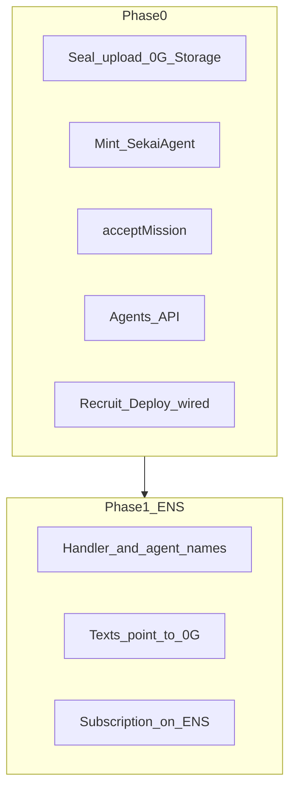

# ENS Roadmap — Prerequisites, then identity

ENS for Sekaigent: handler and agent names, public profile records, and a post-deploy subscription signal on the agent name. Game data lives on **0G**; ENS holds names and pointers.

**Out of scope:** deployment-pass / `submitPlay` gates, rotating addresses, Heat, attestations, dead-drops, declassification resolver, burn-cover, full ERC-8004.

---

## Where data lives

| Data | Storage |
|------|---------|
| Private agent intel, sealed plays, public card JSON | **0G Storage** |
| Ownership, accept, submit, fees, rankings | **0G chain** (`SekaiAgent`, `MissionVault`) |
| ENS name → text records (CCIP-Read index) | API index; values **point at** 0G URIs / on-chain ids — not a second copy of secrets |
| Browser `localStorage` | Not source of truth |

---

## Current baseline

- Contracts: [`SekaiAgent`](../contracts/src/SekaiAgent.sol), [`MissionVault`](../contracts/src/MissionVault.sol)
- Ops scripts (not HTTP): [`scripts/mint-agent.mjs`](../scripts/mint-agent.mjs), [`scripts/upload-agent-intel.mjs`](../scripts/upload-agent-intel.mjs)
- API: missions only — no agents/ENS modules
- Web Squad/Deploy: **localStorage** ([`squadStore`](../apps/web/src/game/stores/squadStore.ts), [`fieldStore`](../apps/web/src/game/stores/fieldStore.ts))

---

## Naming

| Role | Pattern |
|------|---------|
| Root | `{ENS_ROOT_NAME}` e.g. `sekaigent-demo.eth` |
| Player | `{handler}.{root}` → wallet |
| Agent | `{codename}.{handler}.{root}` |

Normalize labels; reject collisions. Private skills / sealed plays never go on ENS.

**Networks:** game on **0G Mainnet**; ENS on **Sepolia** (or Ethereum Mainnet if a root is already owned). Offchain / CCIP-Read resolver — players do not pay ETH per text update.

---

# Phase 0 — Before ENS

Wire Recruit/Deploy to **0G**. Do not build ENS on local squad ids.

### 0.1 Agent API + 0G Storage

- `POST /agents/prepare-mint` — Zod public + private; seal intel; upload private blob + **public card JSON** to 0G Storage → `{ encryptedURI, metadataHash, publicCardURI }`
- `POST /agents/mint` — API minter (`MINTER_ROLE`) → `SekaiAgent.mint` on 0G; Postgres index: `owner`, `token_id`, URIs, `metadata_hash` (index only)
- `GET /agents?owner=` / `GET /agents/:tokenId` — index + fetch public card from 0G when needed

Port logic from existing scripts / [`packages/sdk`](../packages/sdk).

### 0.2 Web off localStorage as source of truth

- Recruit → prepare-mint + mint; keep `tokenId` from chain
- Deploy → `acceptMission{value: fee}(missionId, tokenId)` on 0G
- Squad/field lists from API/chain (localStorage cache only if useful)

### 0.3 Accept indexing

- On accept (client notify or `MissionAccepted` indexer): upsert `missionId` + `tokenId` + txHash in API  
- No ENS yet

### Phase 0 done

- Agent intel + public card on 0G Storage, NFT on 0G, readable from another browser via API/`tokenId`
- Deploy = real fee + `MissionAccepted`
- Squad/deploy do not depend on localStorage as truth

---

# Phase 1 — ENS

Start only after Phase 0 is done.

### 1.1 Infra

- Sepolia root + CCIP-Read resolver; env in `.env.example`
- SDK ENS read helpers; web Sepolia client for resolve (wagmi stays on 0G for game txs)

### 1.2 Names + records

- Claim handler name; create agent subname on mint
- Text records point at 0G / chain, e.g. `com.sekaigent.tokenId`, `com.sekaigent.publicCardURI`, `com.sekaigent.encryptedURI` (URI only), `com.sekaigent.metadataHash`, `description` / `avatar`
- Endpoints: `POST /ens/handlers`, agent name creation from mint path

### 1.3 Subscription signal after accept

- After accept: write on the agent name something like  
  `com.sekaigent.activeMission` = `{ missionId, status, txHash, vault, endsAt }`
- UI shows status from **live resolve**
- This is a public check: resolve the agent name → see they joined mission N. On-chain prize rules stay on `MissionVault` as today.

### Phase 1 done

- Resolve agent name → identity tied to 0G `tokenId` / card URI
- After deploy → resolve shows active mission
- Works in a second browser with no hardcoded identity strings

---

## Endpoints (summary)

| Phase | Endpoint | Role |
|-------|----------|------|
| 0 | `POST /agents/prepare-mint` | Seal + 0G upload |
| 0 | `POST /agents/mint` | Mint on 0G + DB index |
| 0 | `GET /agents…` | List / fetch (card from 0G) |
| 1 | `POST /ens/handlers` | Link player name |
| 1 | (from mint) agent ENS name + texts | |
| 1 | `POST /ens/active-mission` (or equiv.) | Set/clear subscription on ENS |
| 1 | CCIP gateway + `GET /ens/resolve` | Resolve |

---

## Order of work

1. Phase 0.1–0.3  
2. Phase 1 ENS  
3. Keep [`ens-pitch.md`](./ens-pitch.md) aligned (identity + subscription only; no pass gate)

---

## ENS index vs 0G

The resolver needs an API index for names. That store holds **names and pointers**. Blobs stay on **0G Storage**; accept/submit/prizes on **0G chain**.
