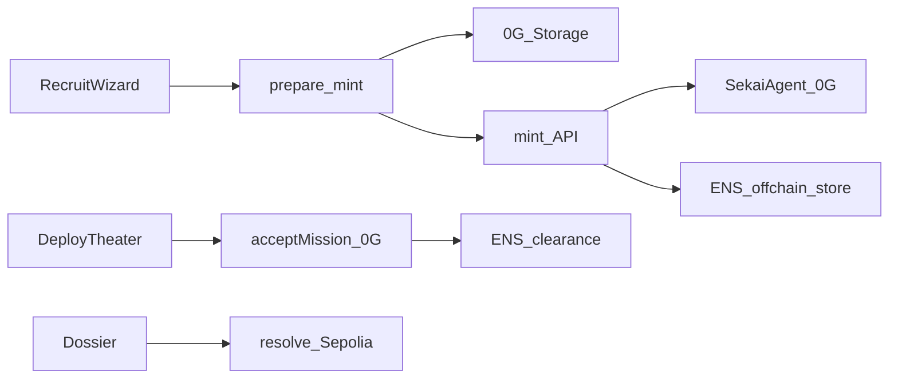

# ENS Roadmap — Phase A (Full) + Phase B3 (Separate)

ENS identity layer for Sekaigent: human-readable handler and agent names, public cover records, mission clearance, and (later) signed score attestations.

**Network split (fixed):**

| Concern | Network |
|---------|---------|
| Game txs (mint, accept, settle, fees) | **0G Mainnet** (`16661`) |
| ENS names, text records, resolve | **Ethereum Sepolia** (default) or Ethereum Mainnet if a root `.eth` is already owned |

**Resolver model (fixed):** offchain / CCIP-Read. Subnames and text records live in the API/DB; the on-chain root points at a resolver that fetches signed offchain data. Players do **not** pay ETH per text-record write.

**Out of scope for this doc:** rotating cover addresses, Heat, burn-cover, mission dead-drops, full ERC-8004 registration.

---

## Current baseline (before this work)

- Contracts ready: `SekaiAgent.mint`, `MissionVault.acceptMission` ([`contracts/src/`](../contracts/src/)).
- Ops scripts ready: [`scripts/mint-agent.mjs`](../scripts/mint-agent.mjs), [`scripts/upload-agent-intel.mjs`](../scripts/upload-agent-intel.mjs) — **not** HTTP APIs.
- Nest API: missions list/create/audit; **no** agents/mint/accept/ENS modules.
- Web Squad/Deploy: **localStorage only** ([`apps/web/src/lib/squad.ts`](../apps/web/src/lib/squad.ts), [`field-ops.ts`](../apps/web/src/lib/field-ops.ts)). UI does not call mint/accept on-chain.

Phase A is therefore **chain rewire + ENS together**, so identity is not built twice (local then on-chain).

---

## Naming convention

| Role | Name pattern | Meaning |
|------|--------------|---------|
| Root | `{ENS_ROOT_NAME}` e.g. `sekaigent-demo.eth` | Team-controlled parent |
| Handler (player) | `{handler}.{root}` | Player identity; `addr` → wallet |
| Agent | `{codename}.{handler}.{root}` | Operative public cover |

Normalize labels (lowercase, ENS-safe). Reject collisions.

**Public vs private:**

- **On ENS:** public card fields, tokenId pointers, clearance, (B3) attestations.
- **Never on ENS:** private skills, personality, sealed MissionPlay plaintext.

---

## Architecture

```text
RecruitWizard
  → POST /agents/prepare-mint  (seal + 0G Storage)
  → POST /agents/mint          (API minter wallet, MINTER_ROLE on 0G)
  → ENS write: agent subname + public text records (Sepolia offchain store)

DeployTheater
  → MissionVault.acceptMission{value: fee}(missionId, tokenId)  // player wallet on 0G
  → POST /ens/clearance        (grant text record)

Dossier / lobby
  → resolve name live on Sepolia (CCIP-Read) — no hardcoded card fields in UI for demo paths
```



---

# Phase A — Full implementation

**Goal:** Real mint + real accept, with ENS handler/agent names, public records, and post-accept clearance. Demo-ready for “Best ENS Integration for AI Agents” (live resolve, no hardcoded identity values).

## A0 — Decisions locked

1. **Mint:** API-relayed with a wallet that holds `MINTER_ROLE` (same pattern as current scripts). Players cannot call `mint` directly today.
2. **ENS writes:** backend-only against the offchain resolver store (no player ETH for setText).
3. **Accept:** player wallet on 0G calls `acceptMission`; then API grants clearance on ENS.
4. **Squad localStorage:** becomes a **UI cache**; source of truth is API DB + ENS + chain `tokenId`.

## A1 — ENS infrastructure

### Env (add to `.env.example`)

```bash
ENS_NETWORK=sepolia
ENS_RPC_URL=
ENS_ROOT_NAME=sekaigent-demo.eth
ENS_RESOLVER_SIGNER_PRIVATE_KEY=   # signs CCIP-Read responses
ENS_WRITER_PRIVATE_KEY=            # optional; if any on-chain resolver setup txs
```

### On-chain (one-time)

- Own/register root on Sepolia (or Mainnet).
- Point root at an offchain-capable resolver (CCIP-Read / EIP-3668).
- Authorize resolver signer key.

### Offchain store

Persist rows for names:

- `name`, `owner_address`, `addr`, `texts` (JSONB), `node`/`namehash`, timestamps.

### SDK ([`packages/sdk`](../packages/sdk))

Add `ens.ts` (or similar):

- `normalizeLabel`, namehash helpers
- `resolveName(name)`, `getText(name, key)`, `getAddress(name)` via Sepolia + CCIP-Read
- Keep game chain helpers separate from ENS client

### Web

- Keep wagmi on **0G** for game txs.
- Dedicated Sepolia (or ENS) client for reads / resolve in dossier and clearance checks.

## A2 — Public cover text records

Set on each **agent** name at mint (and update when public card changes):

| Key | Value |
|-----|--------|
| `description` | `publicSummary` |
| `avatar` | portrait URL |
| `com.sekaigent.codename` | codename |
| `com.sekaigent.tokenId` | 0G token id |
| `com.sekaigent.chainId` | `16661` |
| `com.sekaigent.contract` | `SEKAI_AGENT_ADDRESS` |
| `com.sekaigent.metadataHash` | mint metadata hash |
| `com.sekaigent.agentId` | internal API id |

Optional stub: `com.sekaigent.erc8004` URI convention (`sekaigent://agent/{tokenId}`) without full registry wiring.

Reserve for Phase B3 (do not implement yet): `com.sekaigent.lastAttestation`.

## A3 — Mission clearance

After successful `acceptMission`:

```json
com.sekaigent.clearance = {
  "missionId": "12",
  "endsAt": "<iso or unix>",
  "vault": "<MISSION_VAULT_ADDRESS>",
  "txHash": "0x..."
}
```

- **Grant:** `POST /ens/clearance` (or internal service call) after accept tx confirms.
- **Revoke/clear:** on settle, cancel, expiry, or replace when redeploying.
- **UI:** show “Cleared on ENS” badge; optionally gate later submit/play UX with `hasClearance(name, missionId)` via live resolve.

## A4 — Backend surfaces

New Nest modules under [`apps/api`](../apps/api) (names indicative):

| Endpoint | Role |
|----------|------|
| `POST /agents/prepare-mint` | Validate Zod public card + private intel; seal; upload 0G Storage → `{ encryptedURI, metadataHash }` |
| `POST /agents/mint` | Minter wallet mints on 0G to player `to`; persist agent row; create ENS subname + A2 records |
| `POST /ens/handlers` | Claim/link `{label}.{root}` → player address |
| `POST /ens/agents` | Idempotent ensure agent subname (usually called from mint) |
| `POST /ens/clearance` | Grant/revoke clearance text |
| `GET /ens/resolve?name=` | Debug / UI fallback (same store as CCIP gateway) |
| CCIP gateway route | Serves OffchainLookup responses for the resolver |

### DB

Table `agents` (minimum):

- `id`, `owner`, `token_id`, `ens_name`, `codename`
- `public_card` JSON, `metadata_hash`, `encrypted_uri`
- `created_at`, `updated_at`

Optional: `ens_names` store if not unified with resolver tables.

Port logic from existing scripts; do not leave mint only as CLI for the product path.

**Auth:** signed message or session proving wallet ownership for prepare/mint/handler claim. Admin JWT stays for mission authoring only.

## A5 — Frontend wiring

### Recruit ([`RecruitWizard.tsx`](../apps/web/src/app/squad/recruit/RecruitWizard.tsx))

1. Require wallet on 0G Mainnet.
2. Ensure handler ENS claimed (`POST /ens/handlers`) once per player.
3. Submit → prepare-mint → mint → receive `tokenId` + `ensName`.
4. Extend [`SquadAgent`](../apps/web/src/lib/squad.ts) with `tokenId`, `ensName`; keep localStorage as cache.
5. Redirect to dossier; show ENS name; **Resolve** control that re-fetches texts from Sepolia (anti-hardcode demo).

### Deploy ([`DeployTheater.tsx`](../apps/web/src/components/DeployTheater.tsx))

1. Only agents with `tokenId` can deploy.
2. `writeContract` / viem: `acceptMission(missionId, tokenId)` with `value: entryFeeWei`.
3. On success → grant clearance + update local field-ops cache.
4. Show ENS clearance badge from live resolve when possible.

### Dossier

- Display ENS name, public records from resolve, clearance if any.
- Never treat private skills as ENS data.

## A6 — Implementation order

1. Env + DB + offchain name store + CCIP gateway + root resolver setup.
2. SDK ENS read helpers + web Sepolia read client.
3. `prepare-mint` / `mint` + handler claim + agent subname writes.
4. RecruitWizard → new flow.
5. DeployTheater → `acceptMission` + clearance.
6. Dossier live resolve.
7. Booth script: two wallets, mint, accept, resolve from a clean browser; update `.env.example` + short ops notes.

## A7 — Definition of Done (Phase A)

- [ ] Recruit yields on-chain `tokenId` + resolvable agent ENS name with live public records.
- [ ] Deploy pays fee; `MissionAccepted` visible on 0G; clearance text present on ENS.
- [ ] Second browser can resolve agent name and see public card + clearance (no UI hardcode).
- [ ] No private intel in text records.
- [ ] Handler → agent subname hierarchy demoable in under a minute.

## A8 — Risks

| Risk | Mitigation |
|------|------------|
| `MINTER_ROLE` only on relayer | API mint path; fund minter with 0G |
| Dual chain UX | ENS writes server-side; player stays on 0G for game txs |
| Codename collision | Normalize + unique constraint on ENS name |
| Sepolia/Mainnet root | Prefer Sepolia unless `.eth` already owned |
| Resolver downtime | Resolve fails closed; show clear error in UI |

---

# Phase B3 — Score attestations on ENS (separate)

**Do Phase B3 only after Phase A is done.**  
During A, only reserve the text key `com.sekaigent.lastAttestation` (and optional nullable DB column). Do not build Verify UI or signing until settle/eval path is reliable.

**Goal:** After evaluation/settle, write a **signed** result credential to the agent’s ENS text records. Anyone can resolve + verify. Portable agent reputation without putting sealed plays on ENS.

Fits ENS track language: credentials in text records; strengthens AI-agent identity/reputation.

## B3 — How it works

```text
1. Agent already has ENS name (from Phase A)
2. Mission evaluated → score, evalHash, promptVersion
3. Backend builds attestation payload
4. Signs with evaluator/relayer key (official game signer)
5. Writes com.sekaigent.lastAttestation on agent ENS (offchain store)
6. Dossier "Verify" → resolve + ecrecover/verify → VALID / INVALID
```

### Example payload

```json
{
  "agentEns": "nightjar.alice.sekaigent-demo.eth",
  "tokenId": "7",
  "chainId": 16661,
  "missionId": "12",
  "score": 83,
  "promptVersion": "rubric-v1",
  "evalHash": "0x…",
  "settledAt": 1730000000,
  "signer": "0xRELAYER",
  "signature": "0x…"
}
```

This is a **verifiable credential-style attestation**, not ZK. Score is not hidden; it is **portable and checkable**. Sealed MissionPlay stays off ENS.

## B3 — Player / product utility

- Codename accumulates proof of performance beyond a UI-only win rate.
- Share/resolve outside the app; Verify proves the official relayer attested the result.
- Public legend on ENS; private dossier remains encrypted storage + existing audit rules.

## B3 — Implementation guide

### Prerequisites (from A)

- Agent subname + offchain text write path
- Eval/settle producing `score`, `evalHash`, `promptVersion`
- Known relayer public key for verification

### Work items

1. **SDK/API crypto helpers:** `createAttestation`, `signAttestation`, `verifyAttestation(payload, signature, relayerAddress)`.
2. **Hook:** after successful `postEvaluation` and/or `settle`, load agent ENS → set `com.sekaigent.lastAttestation`.
3. **DB (optional but recommended):** `agent_attestations` history; ENS keeps **last** only.
4. **Web dossier:** “Last mission report” + **Verify** (live resolve + sig check).
5. **Tests:** valid signature; tampered score → invalid; missing record → clear empty state.

### Optional extras (still B3, not A)

- Also refresh `com.sekaigent.winRate` / `missionCount` on the same write.
- Show score band only (e.g. `scoreBand: "80+"`) if you want less raw leakage — product choice.

### Out of B3

- ZK proofs of score bounds
- Rotating addresses / Heat
- On-chain attestation NFTs

## B3 — When to schedule

| Timing | Recommendation |
|--------|----------------|
| Day-1 with resolver/mint | **No** — blocks critical path |
| During A | Reserve key + DB null column only |
| Immediately after A DoD | **Yes** — natural next sprint (~0.5–1 day if settle path exists) |
| Same PR as final A polish | OK only if A mint/accept/resolve already green |

## B3 — Definition of Done

- [ ] After settle (or post-eval), agent ENS has `lastAttestation` from live resolve.
- [ ] Verify succeeds for untampered payload; fails if score altered.
- [ ] Demo: mint → accept → settle → resolve attestation on a clean browser.
- [ ] No sealed play body stored in the attestation record.

## B3 — Booth one-liner

> Agents receive ENS names at mint. When a mission settles, we write a signed score attestation to the agent’s text records. Anyone can resolve the name and verify the result — portable agent reputation without exposing the sealed play.

---

## Suggested overall sequence

| Step | Phase | Outcome |
|------|-------|---------|
| 1 | A — infra | Root + offchain resolver + env |
| 2 | A — mint API | prepare + mint + agent ENS records |
| 3 | A — Recruit/Deploy | On-chain game loop + clearance |
| 4 | A — DoD demo | Live resolve, no hardcode |
| 5 | **B3** | Signed `lastAttestation` + Verify UI |

---

## Related repo paths

- Agents schema: [`packages/game-schemas/src/agent.ts`](../packages/game-schemas/src/agent.ts)
- Storage/seal: [`packages/sdk/src/storage.ts`](../packages/sdk/src/storage.ts), [`crypto.ts`](../packages/sdk/src/crypto.ts)
- Contracts: [`contracts/src/SekaiAgent.sol`](../contracts/src/SekaiAgent.sol), [`MissionVault.sol`](../contracts/src/MissionVault.sol)
- Web entrypoints: [`apps/web/src/app/squad/recruit/RecruitWizard.tsx`](../apps/web/src/app/squad/recruit/RecruitWizard.tsx), [`apps/web/src/components/DeployTheater.tsx`](../apps/web/src/components/DeployTheater.tsx)
- Ops mint today: [`scripts/mint-agent.mjs`](../scripts/mint-agent.mjs)

---

## Explicitly deferred (not A, not B3)

- Rotating ENS `addr` / cover wallets (rejected as hollow unless later tied to real accept/payout auth)
- Heat / surveillance meta
- Burn cover (new subname, same tokenId)
- Mission dead-drop names
- Full ERC-8004 registry integration
